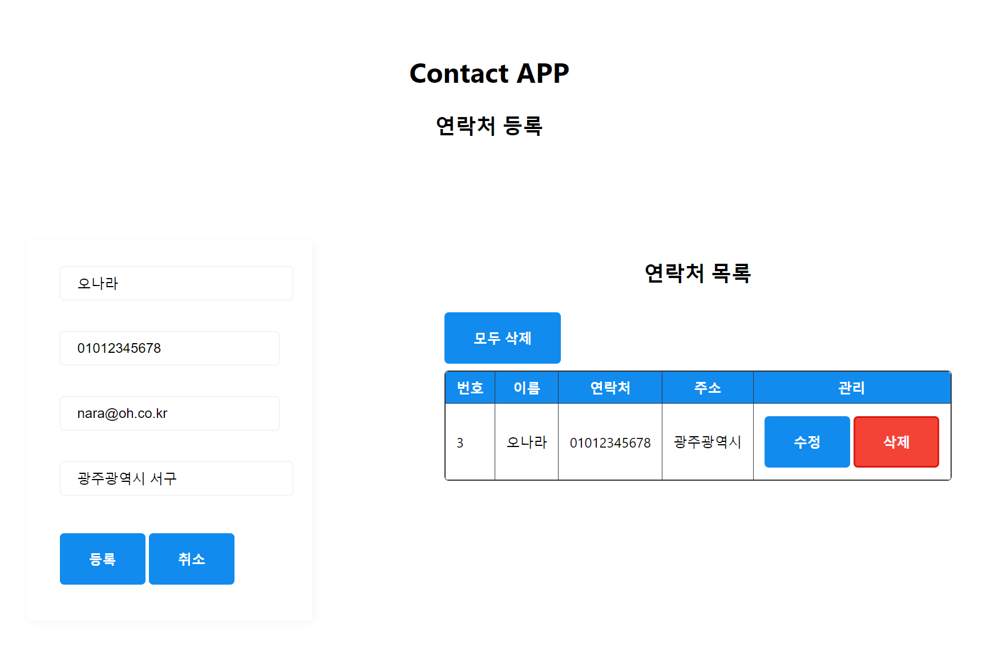
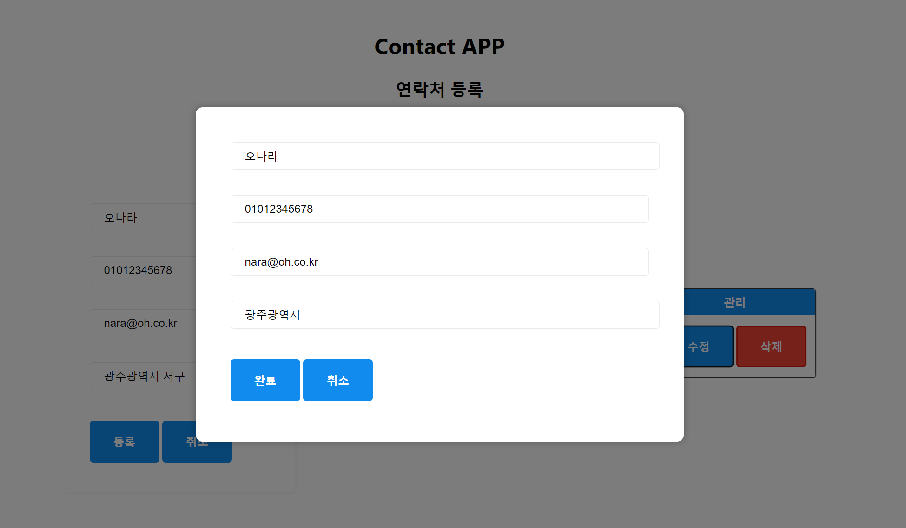

# contact app

연락처 등록관리 앱

# preview

## prerequisite

- [html5 🔎](https://developer.mozilla.org/ko/docs/Glossary/HTML5)
- [css3 🔎](https://developer.mozilla.org/ko/docs/Web/CSS)
- [javascript 🔎](https://developer.mozilla.org/ko/docs/Web/JavaScript)
- [node.js 🔎](https://nodejs.org/en)
- [express.js 🔎](https://expressjs.com/)
- [Sequelize.js 🔎](https://sequelize.org/)
- [MariaDB Community 🔎](https://mariadb.com/downloads/)

## requirement

- front-end : Nunjucks Template Engine
- back-end : MariaDB CRUD with Sequelize.js
- RESTful API : Endpoint (Contact, Note)

## error

- 시퀄라이즈 모델 -> 테이블 변환(Synchronization) 오류 : 최종해결 (discord 참고)
- 모달레이어 -> 포지셔닝 스타일 수정 필요
